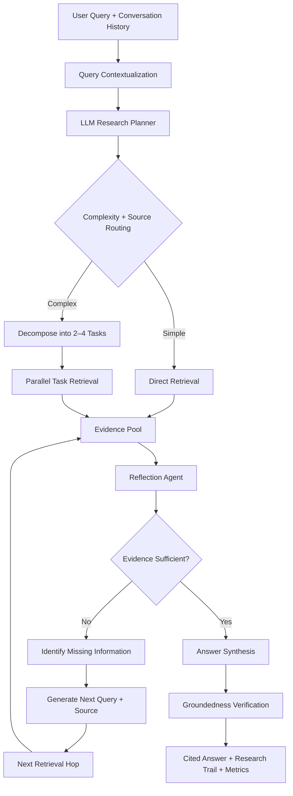
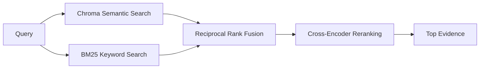
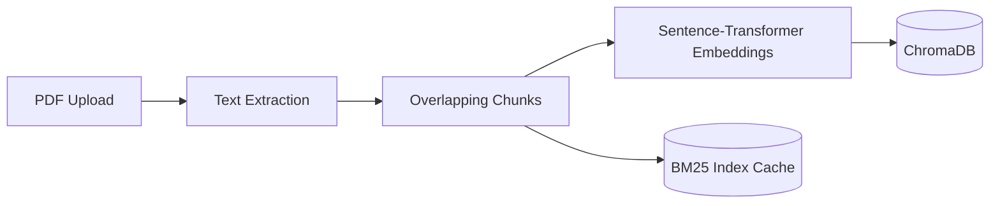

# ResX

> An agentic RAG system that **plans, retrieves, reflects, verifies, and synthesizes** instead of assuming one retrieval pass is enough.

[](https://www.python.org/)
[](https://fastapi.tiangolo.com/)
[](https://react.dev/)
[](LICENSE)
[](https://resx-a-multi-hop-ai-agent-frontend.onrender.com)

**🔗 Live demo:** [resx-a-multi-hop-ai-agent-frontend.onrender.com](https://resx-a-multi-hop-ai-agent-frontend.onrender.com)

> Hosted on Render's free tier — the backend spins down after ~15 minutes of inactivity, so the first request after a while can take 50+ seconds to wake up. Subsequent requests are fast.

## Overview

Most RAG systems use a fixed pipeline:

```text
Query → Retrieve Top-K → Generate Answer
```

That works well for straightforward questions, but complex questions often require evidence that is distributed across documents, concepts, or sources.

This project treats retrieval as an **adaptive research process**. An LLM creates a research plan, the agent retrieves evidence, reflects on what is still missing, performs additional hops when necessary, and finally verifies the generated answer against the evidence.

```text
User Query
    ↓
Contextualization
    ↓
Planning & Routing
    ↓
Initial Retrieval ───────────────┐
    ↓                            │
Reflection                       │ insufficient
    ├── sufficient ──────────────┤
    ↓                            ↓
Synthesis ←────────────── Next Query / New Hop
    ↓
Groundedness Verification
    ↓
Cited Answer + Research Trail
```

## What Makes It Different From Vanilla RAG?

| Vanilla RAG | ResX |
|---|---|
| Usually one retrieval pass | Adaptive multi-hop retrieval |
| Static top-k retrieval | Reflection decides whether more evidence is needed |
| Query is used largely as-is | Query can be contextualized and decomposed |
| Semantic retrieval only is common | Semantic + BM25 + reciprocal-rank fusion + cross-encoder reranking |
| Fixed retrieval depth | Complexity-aware hop budget |
| Generation is the final step | Generation is followed by groundedness verification |
| Retrieval is mostly a black box | Research trail and execution metrics are returned |
| Usually one source | Local PDFs, web search, or hybrid retrieval |

The important distinction is **control flow**: retrieval is not a single preprocessing step; it is part of a feedback loop driven by an evidence-sufficiency decision.

## Architecture

### End-to-end architecture



### Local retrieval pipeline



### Document ingestion



## Core Features

- **LLM research planning** — classifies query complexity and routes work to local documents, the web, or hybrid retrieval.
- **Query contextualization** — resolves conversational follow-ups into standalone research queries.
- **Multi-hop reasoning loop** — reflection identifies missing information and generates the next retrieval query.
- **Hybrid local retrieval** — semantic ChromaDB search + BM25 + Reciprocal Rank Fusion + cross-encoder reranking.
- **Web research** — optional Tavily-powered external retrieval with basic/advanced search depth.
- **Evidence management** — deduplication, citation IDs, document/page metadata, and source tracking.
- **Grounded synthesis** — answers are generated from retrieved evidence with inline `[E1]`, `[E2]` citations.
- **Groundedness check** — a separate model evaluates unsupported claims after synthesis.
- **Bounded execution** — visited-query tracking and maximum hop limits prevent runaway research loops.
- **Observability** — research trail, confidence, retrieval counts, web-search counts, and LLM call counts are exposed through the API and UI.
- **Conversation-aware UI** — React frontend with PDF management, research modes, citations, evidence inspection, and research-trail visualization.
- **Structured validation** — Pydantic models validate API input and model-generated research decisions.
- **Resilience** — retries with exponential backoff and model fallback for rate/capacity failures.

## Research Modes

The UI exposes two optional controls in addition to the planner's normal routing:

- **Web Search** — enables local + external retrieval and web-source evidence.
- **Deep Research** — increases the research depth to up to **5 hops** and uses advanced search depth. When combined with Web Search, the deeper loop can use both local and web evidence.

With neither enabled, the planner chooses the appropriate retrieval source and complex queries can still perform multi-hop local research.

## Local Setup

### Prerequisites

- Python 3.11+
- Node.js 18+
- A [Groq](https://console.groq.com/) API key
- A [Tavily](https://tavily.com/) API key if using web search

### 1. Clone and create the backend environment

```bash
git clone https://github.com/AdarshBobade/Multi-Hop-Retrieval-Agent.git
cd Multi-Hop-Retrieval-Agent

python -m venv .venv
```

Activate it:

**Windows**

```powershell
.venv\Scripts\activate
```

**macOS / Linux**

```bash
source .venv/bin/activate
```

Install dependencies:

```bash
pip install -r requirements.txt
```

### 2. Configure environment variables

Create `.env` in the project root:

```env
GROQ_API_KEY=your_groq_api_key
TAVILY_API_KEY=your_tavily_api_key
```

`TAVILY_API_KEY` is only required for web-search functionality.

### 3. Start the backend

```bash
uvicorn app_data.main:app --reload --port 8000
```

FastAPI's interactive API docs are available at `http://localhost:8000/docs`.

### 4. Start the frontend

In a second terminal:

```bash
cd frontend
npm install
npm run dev
```

Open the Vite URL shown in the terminal, normally `http://localhost:5173`.

### Typical usage

1. Upload one or more PDFs.
2. Ask a research question.
3. Optionally enable **Web Search** or **Deep Research**.
4. Inspect the synthesized answer, citations, research trail, groundedness score, and query statistics.

## Deployment

The app is containerized as two separate services — a FastAPI backend and an nginx-served React frontend — and deployed on [Render](https://render.com/) as two independent web services.

### Run it with Docker locally

```bash
docker compose up --build
```

This builds and runs both containers together:

- **backend** — `python:3.12-slim`, installs `requirements.txt` (CPU-only `torch` build to keep the image lean), runs `uvicorn app_data.main:app`.
- **frontend** — multi-stage build: `node:22-alpine` builds the Vite app, then `nginx:alpine` serves the static bundle and reverse-proxies `/ask`, `/upload`, and `/documents` to the backend.

Visit `http://localhost:5176` once both containers are up.

### Deploying to Render

Each service is a separate Render **Web Service** pointed at this repo:

| Service | Root Directory | Notes |
|---|---|---|
| Backend | `.` (repo root) | Health check path: `/health` |
| Frontend | `frontend` | Env var `BACKEND_URL` set to the backend's live Render URL |

The frontend's `nginx.conf.template` proxies API routes to `${BACKEND_URL}` at container start (via nginx's built-in `envsubst` templating), so the same image works locally (`BACKEND_URL=http://backend:10000`) and in production (`BACKEND_URL=https://<backend>.onrender.com`) without a rebuild.

## Project Structure

```text
Multi-Hop-Retrieval-Agent/
├── app_data/
│   ├── main.py              # FastAPI endpoints
│   ├── agentic_loop.py      # Multi-hop orchestration
│   ├── decomposition.py     # Research planning
│   ├── contextualize.py     # Conversation → standalone query
│   ├── retrieval.py         # Semantic/BM25/hybrid retrieval
│   ├── reranking.py        # Cross-encoder reranking
│   ├── reflection.py       # Evidence sufficiency decisions
│   ├── synthesis.py        # Answer + groundedness verification
│   ├── ingestion.py         # PDF ingestion and document management
│   ├── web_search.py        # Tavily integration
│   ├── models.py            # Pydantic schemas
│   ├── evidence_format.py   # Evidence → LLM context formatting
│   ├── config.py            # API clients and fallback logic
│   └── prompts.py           # Agent prompts
├── frontend/                 # React + TypeScript UI
│   ├── Dockerfile             # Multi-stage: Vite build → nginx serve
│   ├── nginx.conf.template    # Reverse proxy to backend (envsubst at runtime)
│   └── .dockerignore
├── Dockerfile                 # Backend container (Python 3.12-slim + Uvicorn)
├── docker-compose.yml         # Local dev: runs both services together
├── .dockerignore
├── requirements.txt
├── .gitignore
└── LICENSE
```

Runtime data such as uploaded PDFs, ChromaDB, logs, virtual environments, and `.env` files are intentionally excluded through `.gitignore`.

## Engineering Notes

The system deliberately separates **probabilistic decisions** from **deterministic execution**:

- LLMs decide complexity, routing, missing information, and synthesis.
- Pydantic validates structured model outputs before they enter the control flow.
- Python controls hop limits, duplicate prevention, evidence accumulation, and API behavior.
- Retrieval is observable through per-hop research records and execution counters.
- Groundedness is checked independently after answer generation rather than assuming a cited answer is automatically correct.

## License

MIT License. See [LICENSE](LICENSE).
